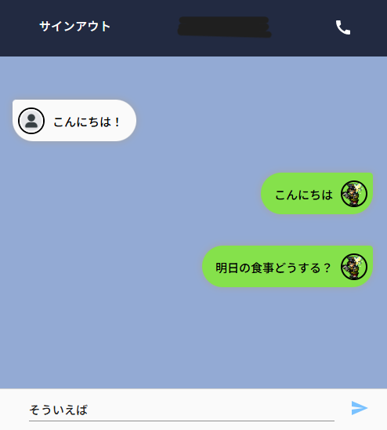

# 💬 LINE風チャットアプリ（React × Firebase）

## 🔍 概要
このアプリは、ReactとFirebaseを用いて開発されたLINE風チャットアプリです。  
Googleアカウントによるログイン・ログアウト、リアルタイムでのメッセージ送受信機能を備えており、複数アカウントによるチャット体験が可能です。  
UIはスマホ風にデザインされ、ユーザーの発言位置・スタイルも反映されています。

## 🛠 使用技術
- React（Hooks / JSX）
- Firebase（Authentication + Firestore）
- CSS（LINE風チャットUI）
- Git / GitHub

## ✨ 主な機能
- Googleログイン / サインアウト機能
- リアルタイムなチャット送受信（Firebase Firestore）
- 自分と他人の発言位置を左右で切り分け表示
- プロフィール画像の表示（未設定時はデフォルトアイコン）
- チャット入力欄のエンター送信対応
- レスポンシブなデザイン

## 📷 スクリーンショット（※一部マスクしています）
### 🔓 ログイン済みチャット画面


## 📂 ディレクトリ構成（抜粋）
```bash
line_clone/ 
├── public/ 
│ ├── index.html 
│ ├── default-avatar.png ← デフォルトアイコン 
├── src/ 
│ ├── firebase.js ← Firebaseの設定 
│ ├── App.jsx 
│ ├── App.css 
│ ├── index.js 
│ └── components/ 
│ ├── Line.js 
│ ├── SendMessage.js 
│ ├── SignIn.js 
│ └── SignOut.js 
├── .gitignore 
├── package.json 
└── README.md
```

## 💻 起動方法（開発用）
```bash
git clone https://github.com/Jozet42/line_clone.git
cd line_clone
npm install
npm start
```
Firebase設定ファイル（src/firebase.js）には自身のプロジェクト情報を記載してください。

## 🧪 今後の拡張案
- チャット履歴のスクロール保存
- メッセージ削除・編集機能
- スタンプ機能や画像送信の追加
- ダークモード切り替え
- モバイルブラウザ最適化の強化

## 🙌 制作メモ
このアプリは職業訓練校でのReact/Firebase学習の一環として制作しました。
シンプルな構成で、認証〜リアルタイム通信までを一通り体験できるアプリとなっています。

## 📝 更新履歴
- 2025/04/15：初回コミット
- 2025/04/17：README作成、仮アイコン導入、スクリーンショット整備、セキュリティ強化済み .gitignore を設定